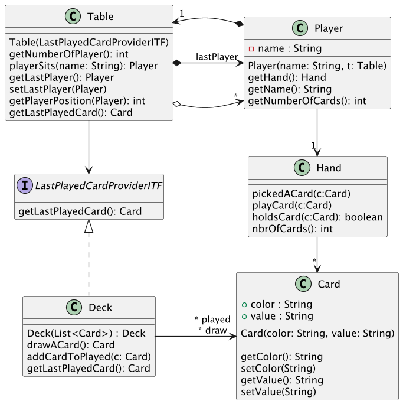

# UML et code 

## Objectif

Le but de cet exercice est de vous faire pratiquer le processus de transformation entre diagrammes UML et code.
Les concepts présentés pour les diagrammes de classe et d'objets sont relativement basiques. Mais il est important de bien comprendre comment leur assemblage fonctionne.

## Consignes

1. A partir du diagramme de classe (0_exercice1.png ou ci-dessous) fourni, implémentez les classes Hand et Card. 
2. A partir du diagramme de classe fourni, explicitez quel est l'objectif du projet, a quoi servent les différentes classes
3. A partir du diagramme de classe fourni, produisez un diagramme d'objet pour une partie de Uno (une table, 4 joueurs, un deck avec 5 cartes).

